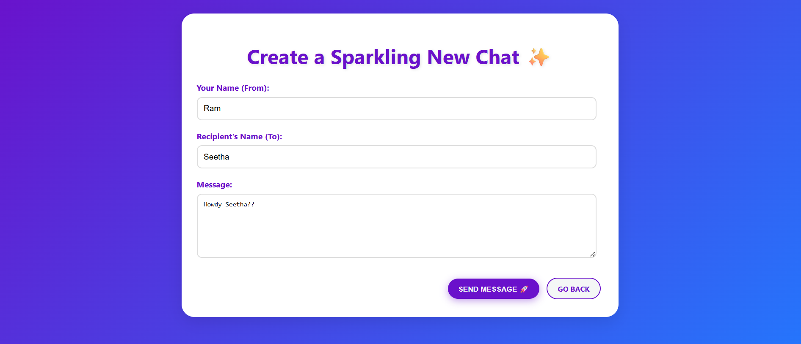
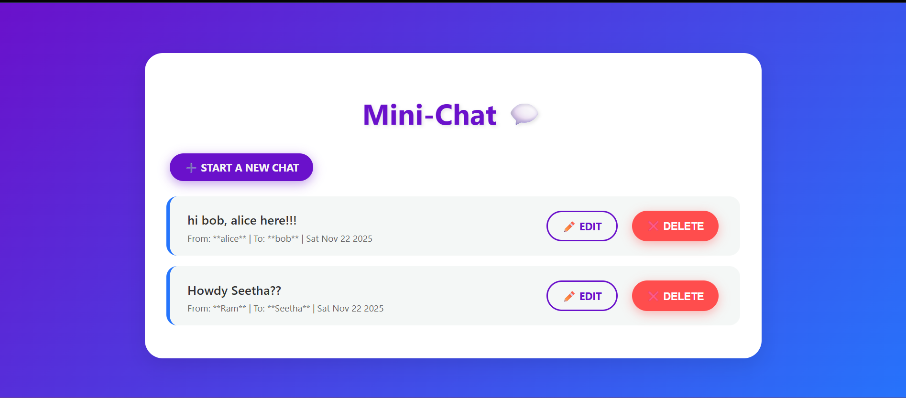

# 🌟MongoMessenger 💬

This is a full-stack mini-chat application built to demonstrate proficiency in core web technologies and modern UI/UX design. It features a complete CRUD (Create, Read, Update, Delete) interface for managing messages, backed by a robust MongoDB database.

### ✨ Key Features

* **Vibrant, Modern UI:** A visually striking interface built with pure HTML and CSS techniques.
* **Full CRUD Implementation:**
    * **C**reate new chats (`/chats/new`).
    * **R**ead and display all chats (`/chats`).
    * **U**pdate (Edit) existing messages (`/chats/:id/edit`).
    * **D**elete chats via a secure, JavaScript-confirmed POST request.
* **Reproducible Environment:** Utilizes `package.json` and `package-lock.json` for consistent deployment and dependency management.

### 🛠️ Technology Stack

| Component | Technology | Rationale |
| :--- | :--- | :--- |
| **Backend** | **Node.js** & **Express.js** | Provides a fast, scalable server-side environment for handling routing and logic. |
| **Database** | **MongoDB** & **Mongoose** | A flexible NoSQL database and an ODM for efficient data modeling and persistence. |
| **Templating** | **EJS (Embedded JS)** | Used for dynamic rendering of server-side data in the HTML structure. |
| **Frontend** | **HTML5, CSS3, JavaScript (ES6+)** | Pure client-side code used for presentation, styling, and interactive delete handling. |

